# Smart Study Buddy - UML Diagrams & Visual Architecture

## 1. System Architecture Diagram

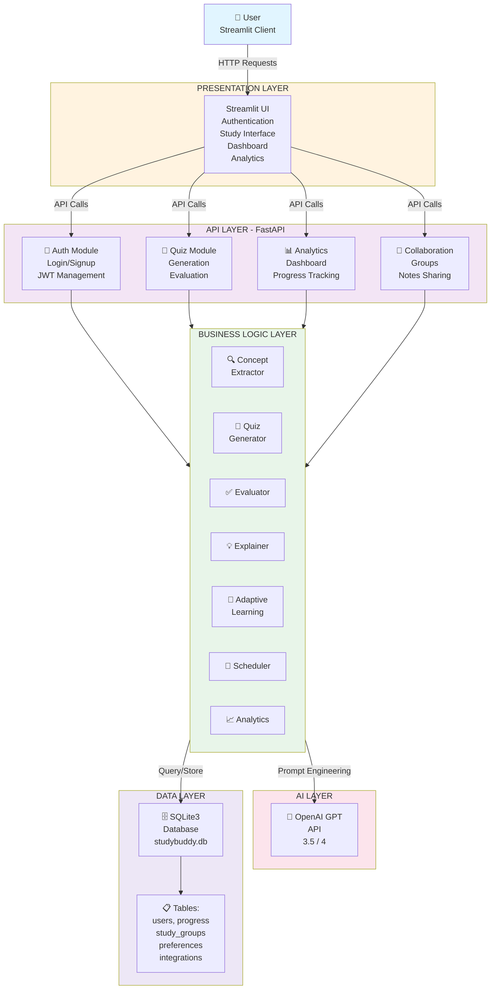

## 2. Class Diagram - Core Modules

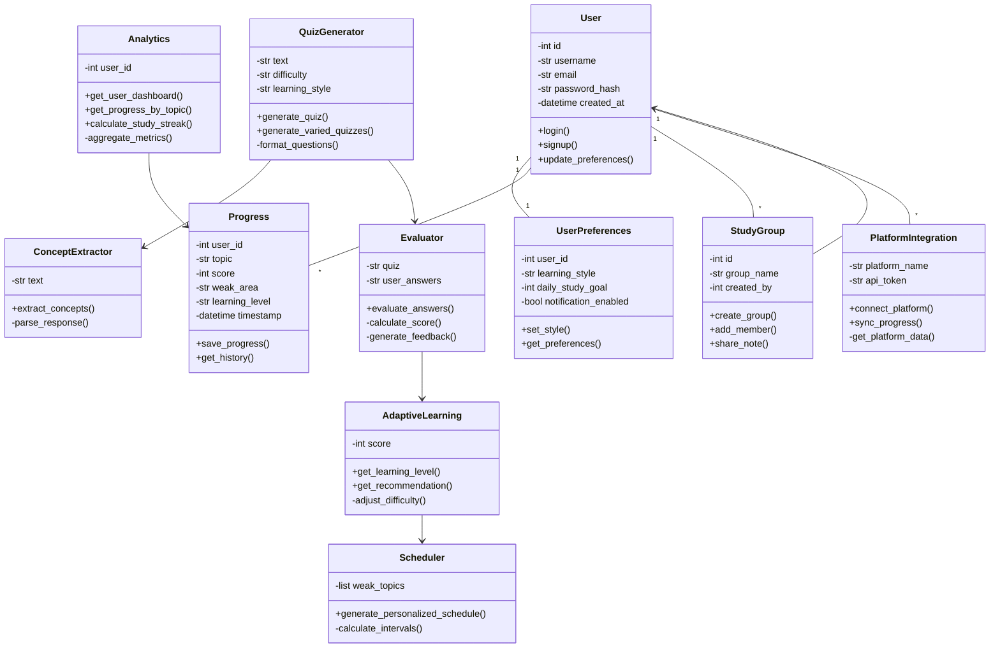

## 3. Database Entity-Relationship Diagram

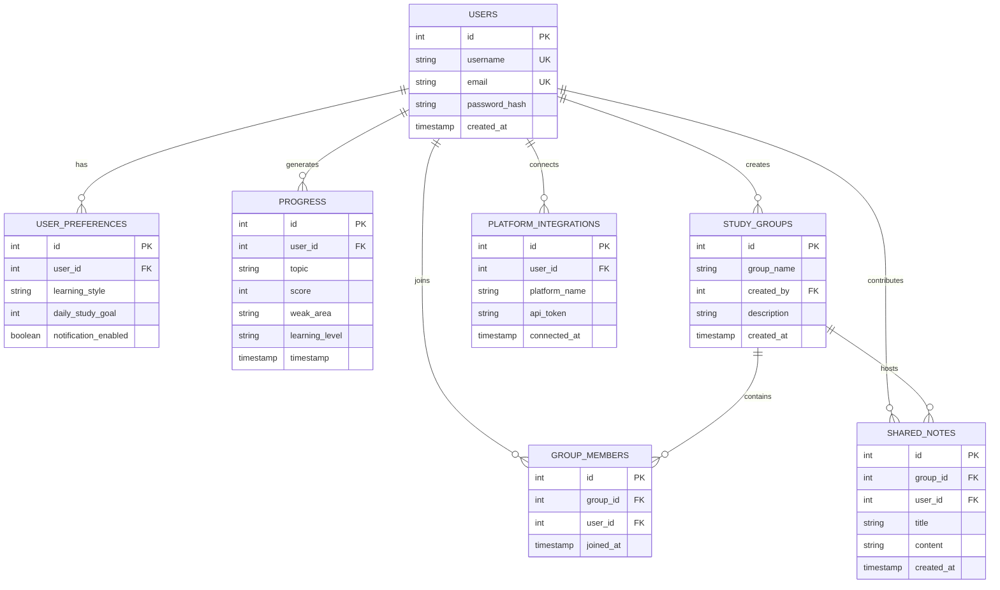

## 4. Quiz Generation Sequence Diagram

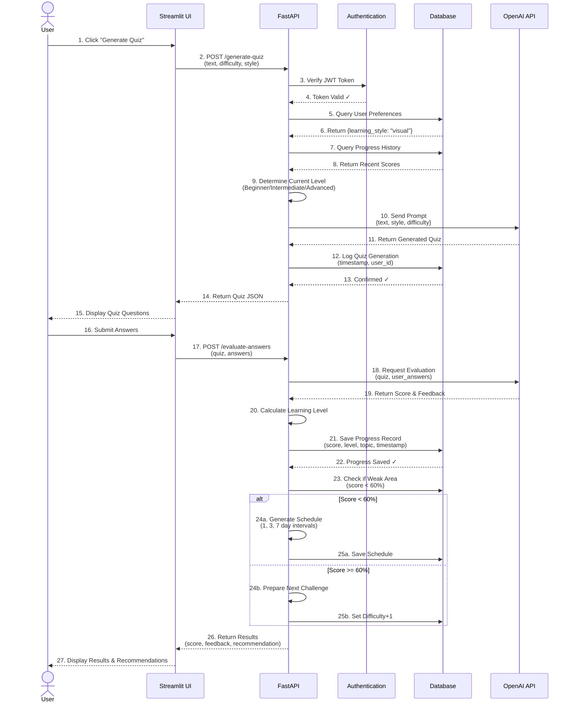

## 5. Learning Journey State Machine

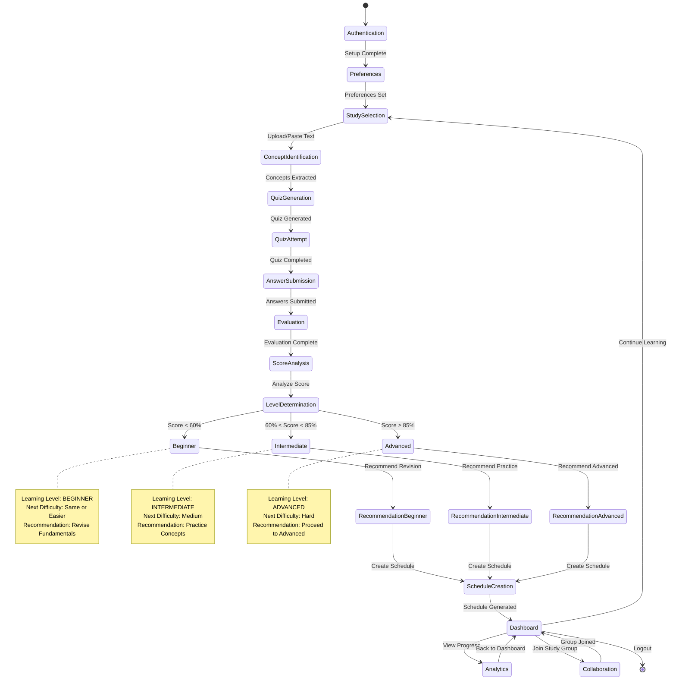

## 6. Adaptive Difficulty Algorithm Flowchart

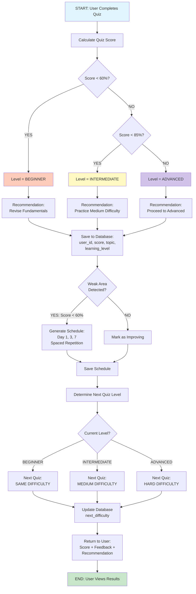

## 7. Three Learning Styles Comparison

```mermaid
graph TB
    Topic["📚 TOPIC:<br/>Photosynthesis"]
    
    subgraph Visual["👁️ VISUAL LEARNER"]
        V1["Display Diagrams"]
        V2["Show Flowcharts"]
        V3["Color-coded Sections"]
        V4["Visual Analogies"]
        V5["ASCII Diagrams"]
    end
    
    subgraph Auditory["🎵 AUDITORY LEARNER"]
        A1["Step-by-Step Narration"]
        A2["Conversational Tone"]
        A3["Key Phrases Repeated"]
        A4["Think-Aloud Commentary"]
        A5["Dialogue Format"]
    end
    
    subgraph Kinesthetic["🤲 KINESTHETIC LEARNER"]
        K1["Hands-On Activities"]
        K2["Real-World Scenarios"]
        K3["Practical Examples"]
        K4["Role-Playing Exercises"]
        K5["Interactive Simulations"]
    end
    
    Topic --> Visual
    Topic --> Auditory
    Topic --> Kinesthetic
    
    V1 --> Q1["Q: Look at diagram,<br/>what does X show?"]
    A1 --> Q2["Q: Explain process<br/>in your words"]
    K1 --> Q3["Q: How would you<br/>apply this?"]
    
    V2 --> Q1
    A2 --> Q2
    K2 --> Q3
    
    V3 --> R1["Quiz Style:<br/>VISUAL"]
    A3 --> R2["Quiz Style:<br/>AUDITORY"]
    K3 --> R3["Quiz Style:<br/>KINESTHETIC"]
    
    style Topic fill:#fff9c4
    style Visual fill:#e1f5ff
    style Auditory fill:#f3e5f5
    style Kinesthetic fill:#e8f5e9
```

## 8. Spaced Repetition Schedule

```mermaid
graph LR
    A["Day 0<br/>LEARN"] -->|Initial Learning| B["✓ Mastered<br/>70% Retention"]
    
    B -->|1 Day Later| C["Day 1<br/>REVIEW 1"]
    C -->|✓| D["✓ Consolidated<br/>80% Retention"]
    
    D -->|3 Days Later| E["Day 3<br/>REVIEW 2"]
    E -->|✓| F["✓ Strengthened<br/>85% Retention"]
    
    F -->|7 Days Later| G["Day 7<br/>REVIEW 3"]
    G -->|✓| H["✓ Mastered<br/>90% Retention"]
    
    H -->|Monitored| I["Long-term<br/>Memory"]
    
    style A fill:#ffccbc
    style B fill:#fff9c4
    style C fill:#fff9c4
    style D fill:#c8e6c9
    style E fill:#c8e6c9
    style F fill:#b3e5fc
    style G fill:#b3e5fc
    style H fill:#ce93d8
    style I fill:#ce93d8
    
    classDef retention fill:#d1c4e9,stroke:#5e35b1,stroke-width:2px
    class B,D,F,H,I retention
```

## 9. User Progress Analytics Flow

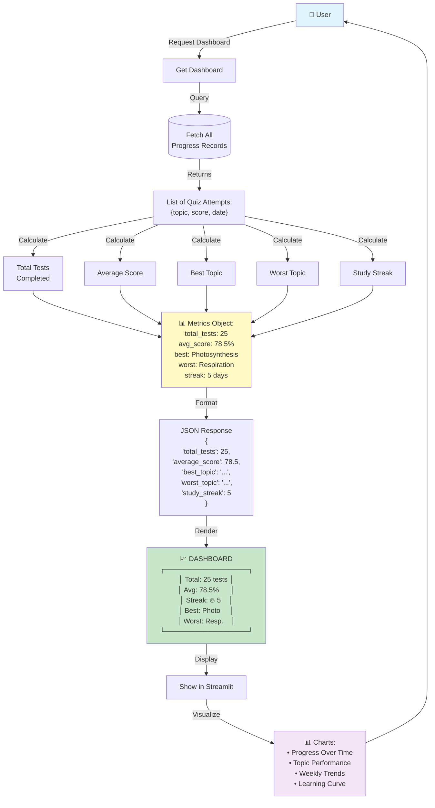

## 10. Multi-Platform Integration Architecture

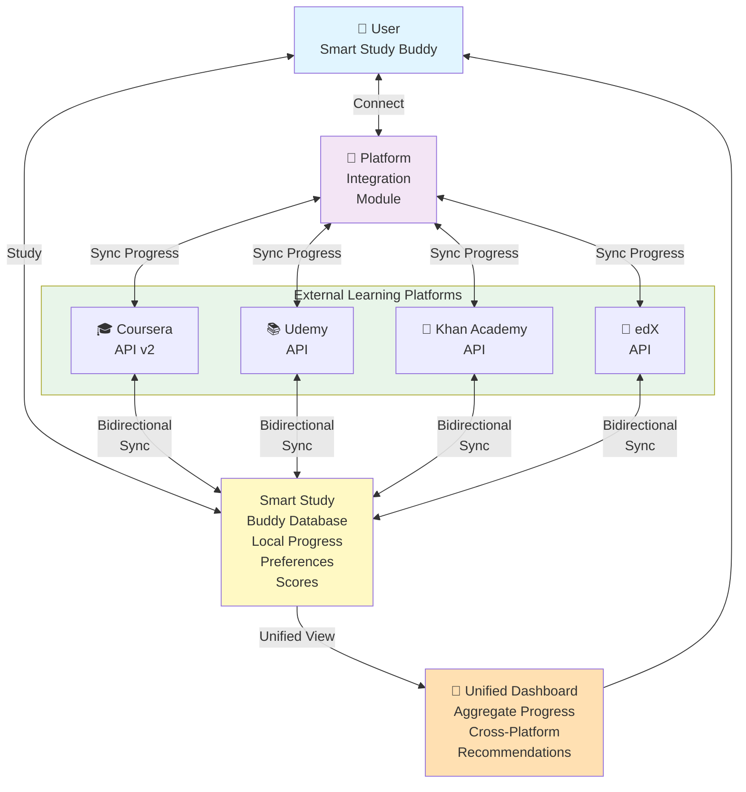

## 11. Collaboration & Study Groups

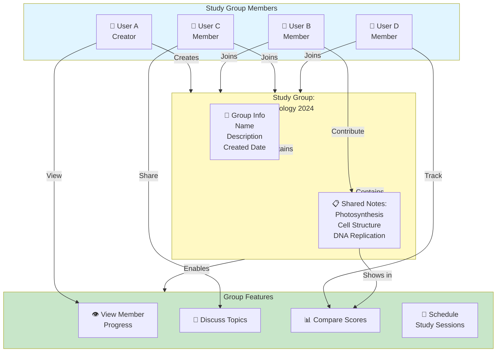

---

## Architecture Summary

### Layer Structure
1. **Presentation Layer** (Streamlit UI)
2. **API Layer** (FastAPI endpoints)
3. **Business Logic** (AI algorithms, adaptations)
4. **AI Layer** (OpenAI GPT integration)
5. **Data Layer** (SQLite database)

### Data Flow
- User interacts with Streamlit UI
- UI sends HTTP requests to FastAPI backend
- Backend applies business logic
- Calls OpenAI APIs for content generation
- Stores/retrieves data from SQLite
- Returns results to UI for visualization

### Key Algorithms
1. **Adaptive Learning**: Adjusts difficulty based on score
2. **Spaced Repetition**: Schedules reviews at optimal intervals
3. **Learning Style Customization**: Generates content matching preference
4. **Progress Analytics**: Calculates comprehensive metrics
5. **Recommendation Engine**: Suggests next steps based on performance

